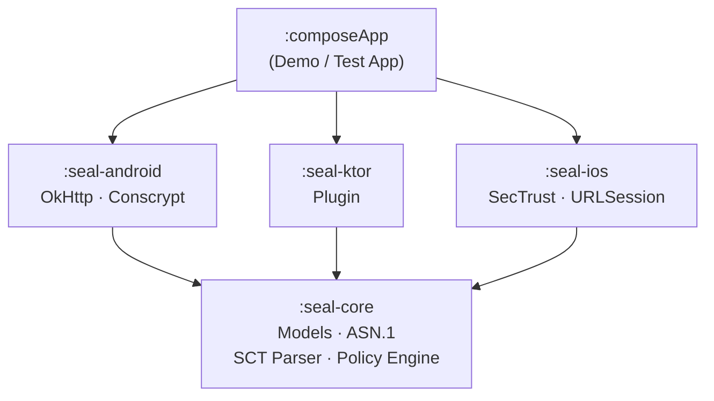

<p align="center">
  
</p>

<h1 align="center">Seal</h1>

<p align="center">
  <strong>Certificate Transparency for Kotlin Multiplatform</strong>
</p>

<p align="center">
  <a href="https://jermeyyy.github.io/seal/"></a>
  <a href="https://central.sonatype.com/search?q=io.github.jermeyyy"></a>
  <a href="https://kotlinlang.org"></a>
  <a href="https://www.jetbrains.com/kotlin-multiplatform/"></a>
  <a href="LICENSE"></a>
</p>

---

Seal is a **Kotlin Multiplatform** library that brings [Certificate Transparency](https://certificate.transparency.dev/) (CT) verification to **Android** and **iOS** applications.
It verifies Signed Certificate Timestamps (SCTs) to ensure TLS certificates have been publicly logged, protecting users against misissued or rogue certificates.

## What is Certificate Transparency?

Certificate Transparency is a public framework of append-only **certificate logs** that allows anyone to monitor the certificates issued for their domains.
When a Certificate Authority (CA) issues a TLS certificate, it submits the certificate to one or more CT logs and receives a **Signed Certificate Timestamp (SCT)** — a cryptographic proof that the certificate has been logged.

Seal verifies these SCTs during HTTPS connections to ensure that:

1. The certificate was publicly logged before use.
2. Enough independent log operators have witnessed the certificate (as required by the configured policy).
3. The SCT signatures are valid and from trusted logs.

Without CT enforcement, a compromised or rogue CA can issue certificates that silently intercept traffic.
Seal closes this gap at the application layer for both Android and iOS.

## Features

- **Cross-platform** — shared verification logic in pure Kotlin with platform-native crypto
- **All 3 SCT delivery methods** — X.509 embedded extensions, TLS extensions, and OCSP stapling
- **OkHttp interceptor** — drop-in network interceptor for Android
- **Ktor plugin** — multiplatform `HttpClient` plugin for Android (OkHttp) and iOS (Darwin)
- **Configurable policies** — built-in Chrome and Apple presets, or define your own
- **Fail-open by default** — connections are never blocked unless you opt in
- **Bundled log list** — ships with an embedded CT log list so verification works offline on first launch
- **Host filtering** — include/exclude hosts with wildcard patterns
- **No Bouncy Castle** — lightweight, pure-Kotlin ASN.1 DER parser; platform APIs handle crypto

## Architecture



| Module | Type | Targets | Purpose |
|--------|------|---------|---------|
| `seal-core` | KMP library | Android, iOS | Data models, ASN.1/SCT parsing, verification engine, CT policies |
| `seal-android` | Android library | Android | Conscrypt integration, OkHttp interceptor, TrustManager wrapper |
| `seal-ios` | KMP library | iOS | SecTrust evaluation, URLSession delegate helpers |
| `seal-ktor` | KMP library | Android, iOS | Ktor `HttpClient` plugin bridging platform implementations |

### Which module do I need?

| Use case | Module(s) |
|----------|-----------|
| Android app with OkHttp | `seal-core` + `seal-android` |
| iOS app with URLSession | `seal-core` + `seal-ios` |
| KMP app with Ktor | `seal-core` + `seal-ktor` |
| KMP app targeting both platforms with Ktor | `seal-core` + `seal-ktor` (platform engines resolved automatically) |

## Installation

### Version Catalog

Add the Seal BOM/versions to your `libs.versions.toml`:

```toml
[versions]
seal = "<version>"

[libraries]
seal-core     = { module = "io.github.jermeyyy:seal-core", version.ref = "seal" }
seal-android  = { module = "io.github.jermeyyy:seal-android", version.ref = "seal" }
seal-ios      = { module = "io.github.jermeyyy:seal-ios", version.ref = "seal" }
seal-ktor     = { module = "io.github.jermeyyy:seal-ktor", version.ref = "seal" }
```

### Gradle Dependencies

```kotlin
// build.gradle.kts

// Core (always required)
commonMain.dependencies {
    implementation(libs.seal.core)
}

// Android — OkHttp interceptor
androidMain.dependencies {
    implementation(libs.seal.android)
}

// iOS — SecTrust / URLSession helpers
iosMain.dependencies {
    implementation(libs.seal.ios)
}

// Ktor plugin (multiplatform — works on both Android and iOS)
commonMain.dependencies {
    implementation(libs.seal.ktor)
}
```

Or with raw coordinates:

```kotlin
implementation("io.github.jermeyyy:seal-core:<version>")
implementation("io.github.jermeyyy:seal-android:<version>")   // Android only
implementation("io.github.jermeyyy:seal-ios:<version>")       // iOS only
implementation("io.github.jermeyyy:seal-ktor:<version>")      // Multiplatform
```

## Quick Start — OkHttp

```kotlin
import com.jermey.seal.android.okhttp.certificateTransparencyInterceptor

val client = OkHttpClient.Builder()
    .addNetworkInterceptor(
        certificateTransparencyInterceptor {
            // All hosts verified by default — no configuration required.
        }
    )
    .build()
```

> **Important:** The interceptor **must** be added as a **network interceptor** (not an application interceptor) so it runs after TLS negotiation and has access to the certificate chain.

## Quick Start — Ktor

```kotlin
import com.jermey.seal.ktor.CertificateTransparency

// Android (OkHttp engine)
val client = HttpClient(OkHttp) {
    install(CertificateTransparency) {
        +"*.example.com"
        -"internal.example.com"
        failOnError = false
    }
}

// iOS (Darwin engine)
val client = HttpClient(Darwin) {
    install(CertificateTransparency) {
        +"*.example.com"
        -"internal.example.com"
        failOnError = false
    }
}
```

The Ktor plugin uses the same configuration DSL on both platforms. The underlying implementation delegates to `seal-android` (OkHttp engine) or `seal-ios` (Darwin engine) automatically.

For full guide, see [Ktor Integration](https://jermeyyy.github.io/seal/guides/ktor).

## OkHttp Integration

The OkHttp integration provides a `CertificateTransparencyInterceptor` that verifies SCTs on every HTTPS request.
It supports all three SCT delivery methods: X.509 embedded, TLS extension, and OCSP stapling.

```kotlin
val client = OkHttpClient.Builder()
    .addNetworkInterceptor(
        certificateTransparencyInterceptor {
            +"*.example.com"
            -"internal.example.com"
            policy = ChromeCtPolicy()
            failOnError = true
            logger = { host, result ->
                Log.d("CT", "$host: $result")
            }
        }
    )
    .build()
```

**Conscrypt** is required for TLS extension and OCSP SCT access. Initialize it early:

```kotlin
class MyApplication : Application() {
    override fun onCreate() {
        super.onCreate()
        ConscryptInitializer.initialize()
    }
}
```

For full guide, see [OkHttp Integration](https://jermeyyy.github.io/seal/guides/okhttp).

## Configuration Reference

Both the OkHttp interceptor and the Ktor plugin share the same DSL (`CTConfigurationBuilder`):

```kotlin
certificateTransparencyInterceptor {
    // ── Host Filtering ──────────────────────────────────────────────
    +"*.example.com"          // include hosts matching pattern
    -"internal.example.com"   // exclude specific hosts (takes precedence)
    // If no includes are specified, all hosts are checked.

    // ── Policy ──────────────────────────────────────────────────────
    policy = ChromeCtPolicy()   // or AppleCtPolicy(), or a custom CTPolicy

    // ── Failure Mode ────────────────────────────────────────────────
    failOnError = false         // false = fail-open (default), true = fail-closed

    // ── Logging ─────────────────────────────────────────────────────
    logger = { host, result ->
        println("CT: $host -> $result")
    }

    // ── Log List ────────────────────────────────────────────────────
    logListUrl = "https://www.gstatic.com/ct/log_list/v3/log_list.json"
    logListCache = myDiskCache   // optional: provide a custom cache
    logListMaxAge = 24.hours     // how long to consider a cached list valid
}
```

### Host Patterns

| Pattern | Matches | Does NOT Match |
|---------|---------|----------------|
| `+"*.example.com"` | `api.example.com`, `www.example.com` | `example.com` |
| `+"**.example.com"` | `deep.sub.example.com` | `example.com` |
| No includes specified | All hosts | — |
| `-"internal.example.com"` | Excluded (even if another pattern includes it) | — |

Excludes always take precedence over includes.

For full reference, see [Configuration](https://jermeyyy.github.io/seal/guides/configuration).

## CT Policy Selection

By default, Seal uses `ChromeCtPolicy`, which requires SCTs from at least one Google-operated
log and one non-Google log. This mirrors Chrome's behavior but can be too strict for some
certificates.

If you encounter "Too few distinct operators" failures, you can switch to Apple's policy:

```kotlin
// Kotlin DSL
installCertificateTransparency {
    useApplePolicy() // or: policy = AppleCtPolicy()
}
```

| Policy | SCT Count (< 180 days) | SCT Count (≥ 180 days) | Operator Diversity |
|--------|----------------------|----------------------|-------------------|
| `ChromeCtPolicy` | ≥ 2 | ≥ 3 | 1 Google + 1 non-Google |
| `AppleCtPolicy` | ≥ 2 | ≥ 3 | 2+ distinct (any) |

## Custom Policies

Seal ships with two built-in CT policies:

| Policy | Description |
|--------|-------------|
| `ChromeCtPolicy()` | Mirrors Chrome's CT requirements — SCT count depends on certificate lifetime (default) |
| `AppleCtPolicy()` | Mirrors Apple's CT requirements — stricter operator diversity rules |

You can implement a custom policy by implementing the `CTPolicy` interface:

```kotlin
val custom = CTPolicy { certificateLifetimeDays, sctResults ->
    val validFromDistinct = sctResults
        .filterIsInstance<SctVerificationResult.Valid>()
        .distinctBy { it.logOperator }
    if (validFromDistinct.size >= 2) {
        VerificationResult.Success.Trusted(validFromDistinct)
    } else {
        VerificationResult.Failure.TooFewDistinctOperators(
            found = validFromDistinct.size,
            required = 2,
        )
    }
}
```

For more details, see [Configuration](https://jermeyyy.github.io/seal/guides/configuration).

## iOS

### SecTrust Integration

`IosCertificateTransparencyVerifier` combines manual embedded-SCT verification with OS-level TLS/OCSP CT checking:

```kotlin
val configuration = ctConfiguration {
    failOnError = true
}
val verifier = IosCertificateTransparencyVerifier(configuration)
val result = verifier.verify(secTrust, host)
```

### URLSession Delegate

`UrlSessionCtHelper` wraps CT verification for use in a `URLSessionDelegate`:

```kotlin
val helper = UrlSessionCtHelper(configuration, verifier)

// In your URLSessionDelegate:
override fun URLSession(
    session: NSURLSession,
    didReceiveChallenge: NSURLAuthenticationChallenge,
    completionHandler: (NSURLSessionAuthChallengeDisposition, NSURLCredential?) -> Unit,
) {
    val (disposition, credential) = helper.handleServerTrustChallenge(didReceiveChallenge)
    completionHandler(disposition, credential)
}
```

### Ktor Darwin Engine

For Ktor-based iOS apps, use the `CertificateTransparency` plugin with the Darwin engine — no additional iOS-specific setup required.

For full guide, see [iOS Integration](https://jermeyyy.github.io/seal/guides/ios).

## Verification Results

Seal reports results through a sealed class hierarchy:

```kotlin
sealed class VerificationResult {
    sealed class Success : VerificationResult() {
        data class Trusted(val validScts: List<SctVerificationResult.Valid>)
        data object InsecureConnection      // HTTP — no TLS
        data object DisabledForHost         // host excluded by matcher
        data object DisabledStaleLogList    // stale log list, policy allows skip
    }
    sealed class Failure : VerificationResult() {
        data object NoScts                  // no SCTs found
        data class TooFewSctsTrusted(val found: Int, val required: Int)
        data class TooFewDistinctOperators(val found: Int, val required: Int)
        data class LogServersFailed(val sctResults: List<SctVerificationResult>)
        data class UnknownError(val cause: Throwable)
    }
}
```

## Platform Notes

### Android

| | |
|---|---|
| **Min SDK** | 24 (Android 7.0) |
| **SCT Methods** | Embedded, TLS extension, OCSP stapling (all three) |
| **Conscrypt** | Required for TLS extension and OCSP SCT access |

### iOS

| | |
|---|---|
| **Min Target** | iOS 15+ |
| **Embedded SCTs** | Verified manually by Seal against its bundled log list |
| **TLS / OCSP SCTs** | Delegated to OS via `SecTrustCopyResult` CT compliance flag |

## API Documentation

Full KDoc API documentation is available at: **[jermeyyy.github.io/seal/api/](https://jermeyyy.github.io/seal/api/)**

## Demo App

The repository includes a Compose Multiplatform demo app that demonstrates OkHttp and Ktor CT verification.

```shell
# Android
./gradlew :composeApp:assembleDebug

# iOS — open in Xcode
open iosApp/iosApp.xcodeproj
```

The demo app makes HTTPS requests and displays CT verification results in real time.

## FAQ / Troubleshooting

<details>
<summary><strong>Why must it be a network interceptor?</strong></summary>

OkHttp network interceptors run *after* the TLS handshake, which means the certificate chain is available for inspection.
Application interceptors run before the connection is established and cannot access TLS state.

</details>

<details>
<summary><strong>What happens when CT verification fails?</strong></summary>

By default (`failOnError = false`), failures are reported through the `logger` callback but the connection proceeds normally (fail-open).
If you set `failOnError = true`, a `SSLPeerUnverifiedException` is thrown and the connection is aborted.

</details>

<details>
<summary><strong>Do I need Conscrypt on Android?</strong></summary>

Conscrypt is required to access TLS extension and OCSP-stapled SCTs. Without it, only embedded X.509 SCTs are verified.
Call `ConscryptInitializer.initialize()` as early as possible (typically in `Application.onCreate()`).

</details>

<details>
<summary><strong>What if the log list is stale or unavailable?</strong></summary>

Seal ships a bundled log list compiled at build time. If the network fetch fails or the cached list is stale, the bundled list is used as a fallback.
When `failOnError = false` (default), a stale log list will not block connections.

</details>

<details>
<summary><strong>Does this library pin certificates?</strong></summary>

No. Seal performs Certificate Transparency verification, not certificate pinning. CT checks that certificates were publicly logged;
pinning restricts which certificates are accepted. They are complementary techniques.

</details>

## Building

```shell
# Build all modules
./gradlew assemble

# Run all tests
./gradlew allTests

# Build the demo app (Android)
./gradlew :composeApp:assembleDebug

# Generate API documentation
./gradlew dokkaGenerateModuleHtml
```

For the iOS demo app, open `iosApp/iosApp.xcodeproj` in Xcode and run from there.

## Contributing

Contributions are welcome! Please open an issue first to discuss what you'd like to change.

1. Fork the repository
2. Create a feature branch (`git checkout -b feature/my-feature`)
3. Commit your changes (`git commit -am 'Add my feature'`)
4. Push to the branch (`git push origin feature/my-feature`)
5. Open a Pull Request

Please ensure all tests pass (`./gradlew allTests`) and follow the existing code style.

## License

This project is licensed under the MIT License - see the [LICENSE](LICENSE) file for details.

---

[Documentation](https://jermeyyy.github.io/seal/) · [API Reference](https://jermeyyy.github.io/seal/api/) · [Certificate Transparency](https://certificate.transparency.dev/) · [Kotlin Multiplatform](https://www.jetbrains.com/help/kotlin-multiplatform-dev/get-started.html)
